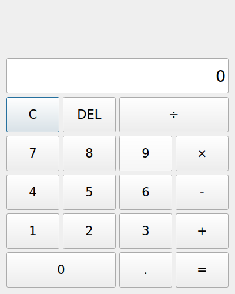
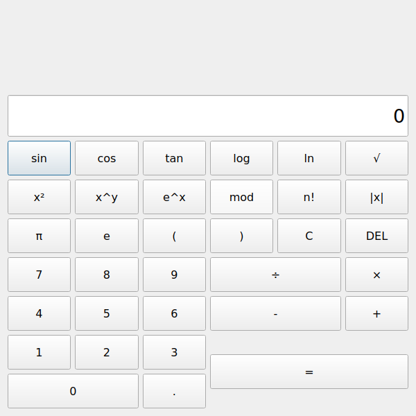

# Qt_homework

## Scientific Calculator Application (工程計算機)

A comprehensive scientific calculator application built with Qt that provides both basic arithmetic operations and advanced scientific functions. The UI is created **entirely programmatically** without using Qt Designer (.ui files).


*Basic Calculator view*


*Scientific Calculator with advanced functions*

### Features

#### Basic Operations
- **Basic Arithmetic**: Addition (+), Subtraction (-), Multiplication (×), Division (÷)
- **Order of Operations**: Follows mathematical precedence rules (power → multiplication/division/modulo → addition/subtraction)
- **Digit Input**: Numbers 0-9
- **Decimal Support**: Floating point calculations
- **Clear Function**: Reset calculator to initial state
- **Delete Function**: Remove last entered digit
- **Error Handling**: Division by zero protection
- **Repeating Equals**: Windows Calculator behavior - pressing = repeatedly continues applying the last operation
- **Programmatic UI**: All widgets and layouts created in C++ code, no UI designer files

#### Scientific Functions

##### Trigonometric Functions
- **sin**: Sine (input in degrees)
- **cos**: Cosine (input in degrees)
- **tan**: Tangent (input in degrees)

##### Logarithmic Functions
- **log**: Base-10 logarithm
- **ln**: Natural logarithm (base e)

##### Power and Root Functions
- **√**: Square root
- **x²**: Square
- **x^y**: Power (raise x to the power of y)
- **e^x**: Exponential function

##### Other Mathematical Functions
- **mod**: Modulo operation (remainder after division)
- **n!**: Factorial (for positive integers up to 170)
- **|x|**: Absolute value

##### Mathematical Constants
- **π**: Pi (3.14159...)
- **e**: Euler's number (2.71828...)

##### Expression Grouping
- **(**: Left parenthesis
- **)**: Right parenthesis

### UI Layout

The scientific calculator features an expanded interface:
- Formula display area at the top showing expressions
- Main display showing input/results
- 6×7 grid of buttons
- Large, easy-to-read buttons with 12pt font
- Display uses 20pt font, right-aligned
- Window size: 600×600 pixels

### Building the Project

```bash
qmake6 Qt_homework.pro
# or use qmake if Qt6 is the default version
make
./Qt_homework
```

### Usage

#### Basic Operations
1. Click digit buttons (0-9) to enter numbers
2. Click operator buttons (+, -, ×, ÷) to select operation
3. Enter second number
4. Click = to see the result
5. **Click = again to repeat the last operation** (Windows Calculator behavior)
   - Example: 5 + 3 = = = gives you 8, 11, 14
6. Click C to clear and start over
7. Click DEL to delete the last digit
8. Click . to add a decimal point

#### Scientific Functions

##### Using Single-Argument Functions
1. Enter a number
2. Click the function button (sin, cos, tan, log, ln, √, x², e^x, n!, |x|)
3. The result appears immediately

**Examples:**
- `30 sin` → 0.5 (sine of 30 degrees)
- `60 cos` → 0.5 (cosine of 60 degrees)
- `16 √` → 4 (square root of 16)
- `5 x²` → 25 (5 squared)
- `100 log` → 2 (log base 10 of 100)
- `5 n!` → 120 (factorial of 5)
- `-5 |x|` → 5 (absolute value of -5)

##### Using Two-Argument Operators
1. Enter first number
2. Click the operator (x^y, mod)
3. Enter second number
4. Click = to see the result

**Examples:**
- `2 x^y 3 =` → 8 (2 to the power of 3)
- `10 mod 3 =` → 1 (remainder of 10 divided by 3)

##### Using Constants
1. Click π or e to insert the constant value
2. The value appears in the display and can be used in calculations

**Examples:**
- `π × 2 =` → 6.28318... (2π)
- `e ln =` → 1 (natural log of e)

##### Using Parentheses
1. Click ( to start a grouped expression
2. Enter your calculation
3. Click ) to close the group
4. Continue with the calculation

**Note:** Parentheses functionality for complex expressions is partially implemented.

### Order of Operations

This scientific calculator follows standard mathematical order of operations (operator precedence):

1. **Power (x^y)** - highest precedence
2. **Multiplication (×), Division (÷), Modulo (mod)** - evaluated left to right
3. **Addition (+), Subtraction (-)** - evaluated left to right, lowest precedence

**Examples:**
- `2 + 3 × 4 =` → Result: **14** (not 20)
  - Calculation: 3 × 4 = 12, then 2 + 12 = 14
- `2 x^y 3 + 1 =` → Result: **9** (not 8)
  - Calculation: 2^3 = 8, then 8 + 1 = 9
- `10 - 2 × 3 =` → Result: **4** (not 24)
  - Calculation: 2 × 3 = 6, then 10 - 6 = 4
- `20 ÷ 4 + 2 =` → Result: **7** (not 3.33)
  - Calculation: 20 ÷ 4 = 5, then 5 + 2 = 7

### Windows Calculator Behavior

This calculator implements the Windows Calculator behavior where pressing the equals button (=) repeatedly will continue to apply the last operation:

- **Example 1**: `5 + 3 = = =` → Results: 8, 11, 14
- **Example 2**: `10 - 2 = = =` → Results: 8, 6, 4
- **Example 3**: `4 × 3 = = =` → Results: 12, 36, 108
- **Example 4**: `100 ÷ 2 = = =` → Results: 50, 25, 12.5
- **Example 5**: `2 x^y 3 = = =` → Results: 8, 64, 512 (2³, 8³, 64³)

### Error Handling

The calculator handles various error conditions:
- **Division by zero**: Displays "Error: Division by zero"
- **Invalid logarithm**: log or ln of negative or zero values
- **Invalid square root**: Square root of negative values
- **Invalid factorial**: Factorial of negative numbers, non-integers, or values > 170

### Technical Details

- **Language**: C++17
- **Framework**: Qt 6
- **Architecture**: MVC pattern with Dialog class
- **Expression Evaluation**: Custom evaluator with proper operator precedence
- **Trigonometric Functions**: Work in degrees (not radians)